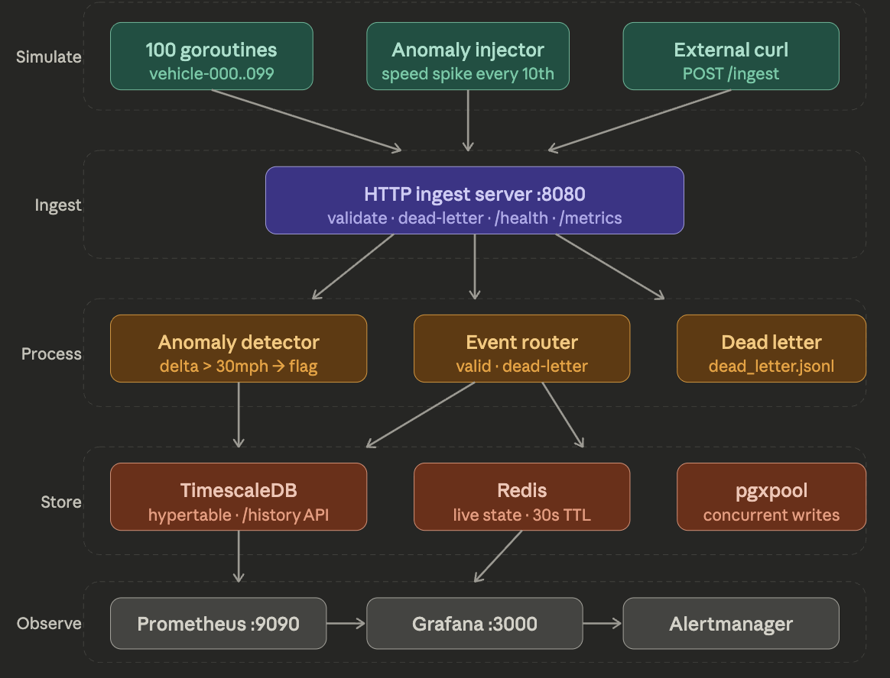
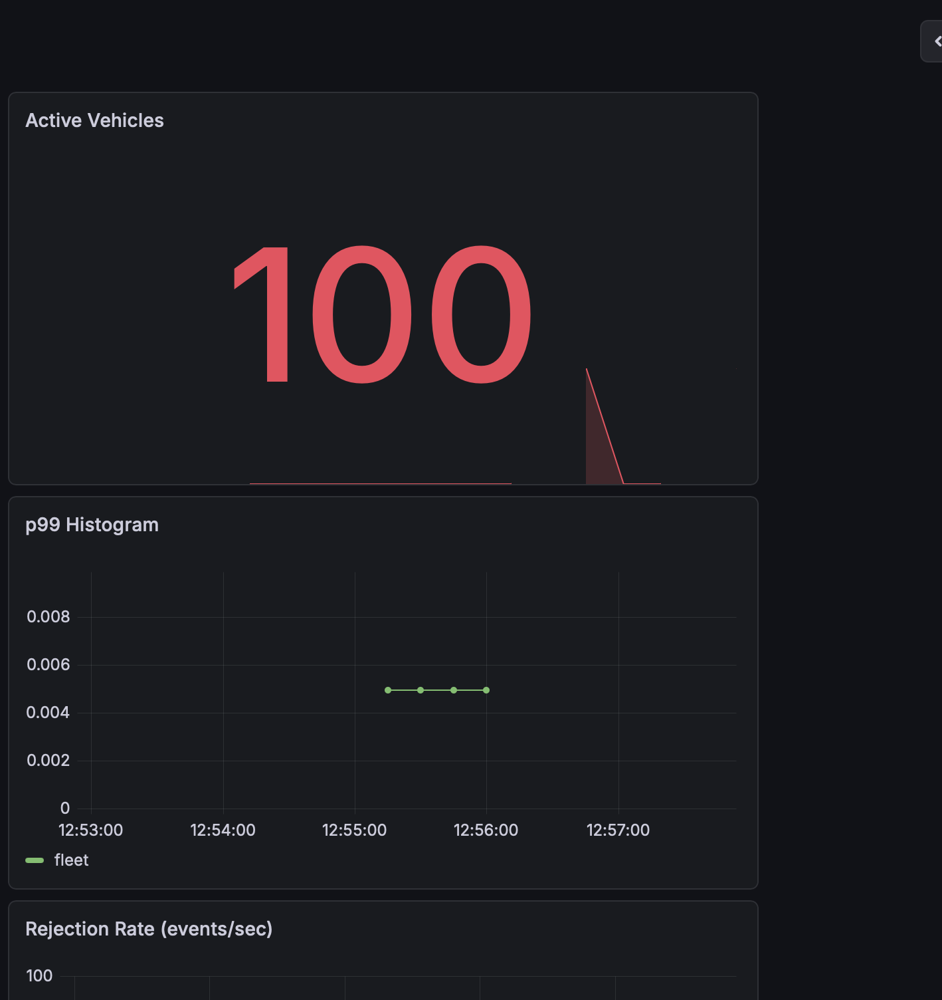
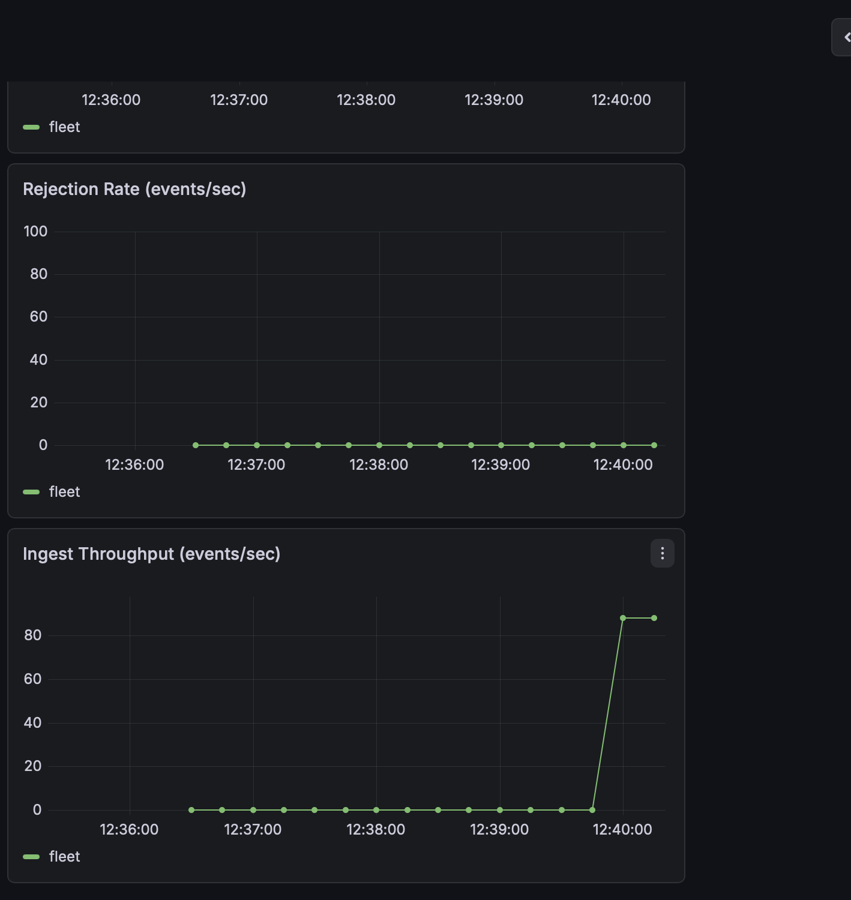

# FleetPulse

A distributed vehicle telemetry ingestion pipeline built in Go, simulating 
the data infrastructure that powers real-time fleet observability.

## Architecture

## What it does

- Simulates 100 concurrent vehicles emitting GPS, speed, and sensor events
- Ingests events through an HTTP server with validation and dead-letter logging
- Dual-writes to TimescaleDB (time-series history) and Redis (live vehicle state)
- Exposes Prometheus metrics with Grafana dashboards and automated alerting

## Performance

- 100+ events/sec sustained throughput
- Sub-5ms p99 ingest latency
- Zero-downtime schema: TimescaleDB hypertable auto-partitions by time

## Observability Dashboard

## Stack 

Go · TimescaleDB · Redis · Prometheus · Grafana · Docker

## Run it

git clone ...
docker compose up -d
go run .

### Dashboard at http://localhost:3000 (admin/admin)
### Metrics at http://localhost:8080/metrics
